SENTIMENT ANALYSIS OF TWITTER FEEDS  
===================================
  
DEPARTMEMT OF MATHEMATICS  
-------------------------
INDIAN INSTITUTE OF TECHNOLOGY, DELHI  
-------------------------------------  
  
  
  
  
  
  
  

###  Yogesh Garg  

###  Dr. Niladri Chatterjee  

### July, 2014

# Contents

    1  Introduction  
        1.1  Sentiment Analysis  
        1.2  Twitter  
    2  Literature Review  
    3  Methodology  
        3.1  Datasets  
            3.1.1  Twitter Sentiment Corpus  
            3.1.2  Stanford Twitter  
        3.2  Pre Processing  
            3.2.1  Hashtags  
            3.2.2  Handles  
            3.2.3  URLs  
            3.2.4  Emoticons  
            3.2.5  Punctuations  
            3.2.6  Repeating Characters  
        3.3  Stemming Algorithms  
            3.3.1  Porter Stemmer  
            3.3.2  Lemmatization  
        3.4  Features  
            3.4.1  Unigrams  
            3.4.2  N-grams  
            3.4.3  Negation Handling  
    4  Experimentation  
        4.1  Naive Bayes  
        4.2  Maximum Entropy Classifier  
    5  Future Work  
    6  Conclusion  

# List of Tables

    1  Twitter Sentiment Corpus  
    2  Stanford Corpus  
    3  Frequency of Features per Tweet  
    4  List of Emoticons  
    5  List of Punctuations  
    6  Number of words before and after pre-processing  
    7  Porter Stemmer Steps  
    8  Explicit Negation Cues  

# List of Figures

    1  Schematic Diagram of Methodology  
    2  Illustration of a Tweet with various features  
    3  Cumulative Frequency Plot for 50 Most Frequent Unigrams  
    4  Zipf's Law - Log Frequency versus Log Rank plot for unigrams  
    5  Number of n-grams vs. Number of Tweets  
    6  Number of repeating n-grams vs. Number of Tweets  
    7  Cumulative Frequency Plot for 50 Most Frequent Bigrams  
    8  Cumulative Frequency Plot for 50 Most Frequent Trigrams  
    9  Scope of Negation  
    10  Accuracy for Naive Bayes Classifier  
    11  Precision vs. Recall for Naive Bayes Classifier  
    12  Precision vs. Recall for Maximum Entropy Classifier  

##  1  Introduction

###  1.1  Sentiment Analysis

Sentiment Analysis refers to the use of text analysis and natural language
processing to identify and extract subjective information in textual contents.
There are two type of user-generated content available on the web – facts and
opinions. Facts are statements about topics and in the current scenario,
easily collectible from the Internet using search engines that index documents
based on topic keywords. Opinions are user specific statement exhibiting
positive or negative sentiments about a certain topic. Generally opinions are
hard to categorize using keywords. Various text analysis and machine learning
techniques are used to mine opinions from a document [1]. Sentiment Analysis
finds its application in a variety of domains.

**Business**
     Businesses may use sentiment analysis on blogs, review websites etc. to judge the market response of a product. This information may also be used for intelligent placement of advertisements. For example, if product "A" and "B" are competitors and an online merchant business "M" sells both, then "M" may advertise for "A" if the user displays positive sentiments towards "A", its brand or related products, or "B" if they display negative sentiments towards "A". 
**Government**
     Governments and politicians can actively monitor public sentiments as a response to their current policies, speeches made during campaigns etc. This will help them make create better public awareness regarding policies and even drive campaigns intelligently. 
**Financial Markets**
     Public opinion regarding companies can be used to predict performance of their stocks in the financial markets. If people have a positive opinion about a product that a company A has launched, then the share prices of A are likely to go higher and vice versa. Public opinion can be used as an additional feature in existing models that try to predict market performances based on historical data. 

###  1.2  Twitter

Twitter is an online social networking and micro-blogging service that enables
users to create and read short messages, called "Tweets". It is a global forum
with the presence of eminent personalities from the field of entertainment,
industry and politics. People tweet about their life, events and express
opinion about various topics using text messages limited to 140 characters.
Registered users can read and post tweets, but any unregistered users can read
them. Twitter can be accessed via Web, SMS, or mobile apps. Traditionally a
large volume of research in sentiment analysis and opinion mining has been
directed towards larger pieces of text like movie reviews. Sentiment Analysis
in micro-blogging sphere is relatively new. From the perspective of Sentiment
Analysis, we discuss a few characteristics of Twitter:

**Length of a Tweet**
     The maximum length of a Twitter message is 140 characters. This means that we can practically consider a tweet to be a single sentence, void of complex grammatical constructs. This is a vast difference from traditional subjects of Sentiment Analysis, such as movie reviews. 
**Language used**
     Twitter is used via a variety of media including SMS and mobile phone apps. Because of this and the 140-character limit, language used in Tweets tend be more colloquial, and filled with slang and misspellings. Use of hashtags also gained popularity on Twitter and is a primary feature in any given tweet. Our analysis shows that there are approximately 1-2 hashtags per tweet, as shown in Table 3 . 
**Data availability**
     Another difference is the magnitude of data available. With the Twitter API, it is easy to collect millions of tweets for training. There also exist a few datasets that have automatically and manually labelled the tweets [2] [3]. 
**Domain of topics**
     People often post about their likes and dislikes on social media. These are not al concentrated around one topic. This makes twitter a unique place to model a generic classifier as opposed to domain specific classifiers that could be build datasets such as movie reviews. 

##  2  Literature Review

Pang and Lee discuss in detail the current techniques in the area of sentiment
analysis. Much of it revolves around reviews for movies and products.

Go, Bhayani and Huang (2009) were among the first to explore sentiment
analysis on Twitter [2]. They classify Tweets for a query term into negative
or positive sentiment. They collect training dataset automatically from
Twitter. To collect positive and negative tweets, they query twitter for happy
and sad emoticons. Happy emoticons are different versions of smiling face,
like "`:)`", "`:-)`", "`: )`", "`:D`", "`=)`" etc. Sad emoticons include
frowns, like "`:(`", "`:-(`", "`:(`" etc. They try various features –
unigrams, bigrams and Part-of-Speech and train their classifier on various
machine learning algorithms – Naive Bayes, Maximum Entropy and Scalable Vector
Machines and compare it against a baseline classifier by counting the number
of positive and negative words from a publicly available corpus. They report
that Bigrams alone and Part-of-Speech Tagging are not helpful and that Naive
Bayes Classifier gives the best results.

Pak and Paroubek (2010) use a similar distant supervision technique to
automatically collect the dataset from the web [4]. Apart from using happy and
sad emoticons for positive and negative sentiment respectively, they also
query tweets from accounts of 44 newspapers, like “New York Times”,
“Washington Posts” etc. to collect a training set of subjective tweets. They
use unigrams and filtered n-grams for their classification. They also handle
negations by attaching negative cues, like “no”, “not” to the words preceding
and following them. They report that both bigrams and negation handling help.

Koulompis, Wilson and Moore (2011) identify that use of informal and creative
language make sentiment analysis of tweets a rather different task [5]. They
leverage previous work done in hashtags and sentiment analysis to build their
classifier. They use Edinburgh Twitter corpus to find out most frequent
hashtags. They manually classify these hashtags and use them to in turn
classify the tweets. Apart from using n-grams and Part-of-Speech features,
they also build a feature set from already existing MPQA subjectivity lexicon
and Internet Lingo Dictionary. They report that the best results are seen with
n-gram features with lexicon features, while using Part-of-Speech features
causes a drop in accuracy.

Saif, He and Alani (2012) discuss a semantic based approach to identify the
entity being discussed in a tweet, like a person, organization etc. [6]. They
also demonstrate that removal of stop words is not a necessary step and may
have undesirable effect on the classifier.

All of the aforementioned techniques rely on n-gram features. It is unclear
that the use of Part-of-Speech tagging is useful or not. To improve accuracy,
some employ different methods of feature selection or leveraging knowledge
about micro-blogging. In contrast, we improve our results by using more basic
techniques used in Sentiment Analysis, like stemming, two-step classification
and negation detection and scope of negation.

Negation detection is a technique that has often been studied in sentiment
analysis. Negation words like “not”, “never”, “no” etc. can drastically change
the meaning of a sentence and hence the sentiment expressed in them. Due to
presence of such words, the meaning of nearby words becomes opposite. Such
words are said to be in the scope of negation. Many researches have worked on
detecting the scope of negation.

The scope of negation of a cue can be taken from that word to the next
following punctuation. Councill, McDonald and Velikovich (2010) discuss a
technique to identify negation cues and their scope in a sentence [7]. They
identify explicit negation cues in the text and for each word in the scope.
Then they find its distance from the nearest negative cue on the left and
right.

##  3  Methodology

We use different feature sets and machine learning classifiers to determine
the best combination for sentiment analysis of twitter. We also experiment
with various pre-processing steps like - punctuations, emoticons, twitter
specific terms and stemming. We investigated the following features -
unigrams, bigrams, trigrams and negation detection. We finally train our
classifier using various machine-learning algorithms - Naive Bayes, Decision
Trees and Maximum Entropy.

!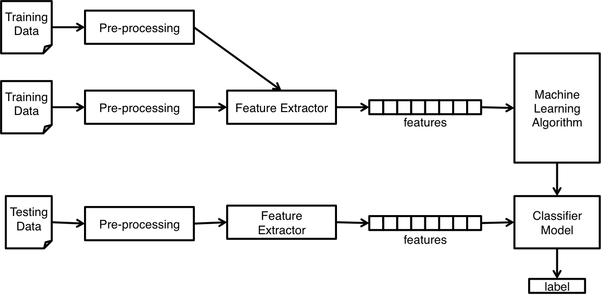

Figure 1: Schematic Diagram of Methodology

We use a modularized approach with feature extractor and classification
algorithm as two independent components. This enables us to experiment with
different options for each component. Figure 1 illustrates different steps
taken in the entire process.

###  3.1  Datasets

One of the major challenges in Sentiment Analysis of Twitter is to collect a
labelled dataset. Researchers have made public the following datasets for
training and testing classifiers.

####  3.1.1  Twitter Sentiment Corpus

This is a collection of 5513 tweets collected for four different topics,
namely, Apple, Google, Microsoft, Twitter It is collected and hand-classified
by Sanders Analytics LLC [3]. Each entry in the corpus contains, Tweet id,
Topic and a Sentiment label. We use Twitter-Python library to enrich this data
by downloading data like Tweet text, Creation Date, Creator etc. for every
Tweet id. Each Tweet is hand classified by an American male into the following
four categories. For the purpose of our experiments, we consider Irrelevant
and Neutral to be the same class. Illustration of Tweets in this corpus is
show in Table 1 .

**Positive**
     For showing positive sentiment towards the topic
**Positive**
     For showing no or mixed or weak sentiments towards the topic
**Negative**
     For showing negative sentiment towards the topic
**Irrelevant**
     For non English text or off-topic comments

<table border="1">
<tr><td align="left">Class </td><td align="right">Count </td><td width="0">Example </td></tr>
<tr><td align="left">neg </td><td align="right">529 </td><td width="0">#Skype often crashing: #microsoft, what are you doing? </td></tr>
<tr><td align="left">neu </td><td align="right">3770 </td><td width="0">How #Google Ventures Chooses Which Startups Get Its $200
                Million http://t.co/FCWXoUd8 via @mashbusiness @mashable </td></tr>
<tr><td align="left">pos </td><td align="right">483 </td><td width="0">Now all @Apple has to do is get swype on the iphone and
                it will be crack. Iphone that is </td></tr></table>

<!---->

Table 1: Twitter Sentiment Corpus

####  3.1.2  Stanford Twitter

This corpus of tweets, developed by Sanford’s Natural Language processing
research group, is publically available [2]. The training set is collected by
querying Twitter API for happy emoticons like "`:)`" and sad emoticons like
"`:(`" and labelling them positive or negative. The emoticons were then
stripped and Re-Tweets and duplicates removed. It also contains around 500
tweets manually collected and labelled for testing purposes. We randomly
sample and use 5000 tweets from this dataset. An example of Tweets in this
corpus are shown in Table 2 .

<table border="1">
<tr><td align="left">Class </td><td align="right">Count </td><td width="0">Example </td></tr>
<tr><td align="left">neg </td><td align="right">2501 </td><td width="0">Playing after the others thanks to TV scheduling may well allow us to know what's go on, but it makes things look bad on Saturday nights  </td></tr>
<tr><td align="left">pos </td><td align="right">2499 </td><td width="0">@francescazurlo HAHA!!! how long have you been singing that song now? It has to be at least a day. i think you're wildly entertaining!  </td></tr></table>

<!---->

Table 2: Stanford Corpus

###  3.2  Pre Processing

User-generated content on the web is seldom present in a form usable for
learning. It becomes important to normalize the text by applying a series of
pre-processing steps. We have applied an extensive set of pre-processing steps
to decrease the size of the feature set to make it suitable for learning
algorithms. Figure 2 illustrates various features seen in micro-blogging.
Table 3 illustrates the frequency of these features per tweet, cut by
datasets. We also give a brief description of pre-processing steps taken.

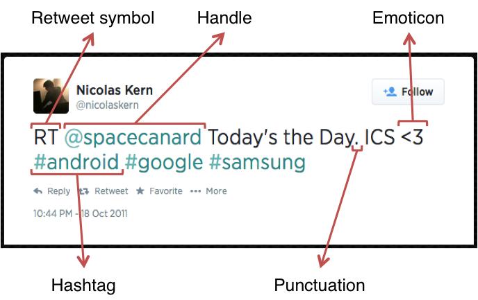

Figure 2: Illustration of a Tweet with various features

<table border="1">
<tr><td align="left"></td><td colspan="2" align="center">Twitter Sentiment
 </td><td colspan="2" align="center">Stanford Corpus
 </td><td colspan="2" align="center">Both </td></tr>
<tr><td align="left">Features   </td><td colspan="1" align="center">Avg. </td><td colspan="1" align="center">Max.
            </td><td colspan="1" align="center">Avg. </td><td colspan="1" align="center">Max.
            </td><td colspan="1" align="center">Avg. </td><td colspan="1" align="center">Max. </td></tr>
<tr><td align="left">Handles        </td><td align="right">0.6761 </td><td align="right">8 </td><td align="right">0.4888 </td><td align="right">10 </td><td align="right">0.5804 </td><td align="right">10 </td></tr>
<tr><td align="left">Hashtags   </td><td align="right">2.0276 </td><td align="right">13 </td><td align="right">0.0282 </td><td align="right">11 </td><td align="right">1.0056 </td><td align="right">13 </td></tr>
<tr><td align="left">Urls       </td><td align="right">0.4431 </td><td align="right">4 </td><td align="right">0.0452 </td><td align="right">2 </td><td align="right">0.2397 </td><td align="right">4 </td></tr>
<tr><td align="left">Emoticons  </td><td align="right">0.0550 </td><td align="right">3 </td><td align="right">0.0154 </td><td align="right">4 </td><td align="right">0.0348 </td><td align="right">4 </td></tr>
<tr><td align="left">Words      </td><td align="right">14.4084 </td><td align="right">31 </td><td align="right">13.2056 </td><td align="right">33 </td><td align="right">13.7936 </td><td align="right">33 </td></tr></table>

<!---->

Table 3: Frequency of Features per Tweet

####  3.2.1  Hashtags

A hashtag is a word or an un-spaced phrase prefixed with the hash symbol (#).
These are used to both naming subjects and phrases that are currently in
trending topics. For example, #iPad, #news

Regular Expression: `#(\w+)`

Replace Expression: `HASH_\1`

####  3.2.2  Handles

Every Twitter user has a unique username. Any thing directed towards that user
can be indicated be writing their username preceded by ‘@’. Thus, these are
like proper nouns. For example, @Apple

Regular Expression: `@(\w+)`

Replace Expression: `HNDL_\1`

####  3.2.3  URLs

Users often share hyperlinks in their tweets. Twitter shortens them using its
in-house URL shortening service, like http://t.co/FCWXoUd8 - such links also
enables Twitter to alert users if the link leads out of its domain. From the
point of view of text classification, a particular URL is not important.
However, presence of a URL can be an important feature. Regular expression for
detecting a URL is fairly complex because of different types of URLs that can
be there, but because of Twitter’s shortening service, we can use a relatively
simple regular expression.

Regular Expression: `(http|https|ftp)://[a-zA-Z0-9\\./]+`

Replace Expression: `URL`

####  3.2.4  Emoticons

Use of emoticons is very prevalent throughout the web, more so on micro-
blogging sites. We identify the following emoticons and replace them with a
single word. Table 4 lists the emoticons we are currently detecting. All other
emoticons would be ignored.

 
<table border="1">
<tr><td colspan="1" align="center">Emoticons </td><td colspan="6" align="center">Examples </td></tr>
<tr><td align="left"><tt>EMOT_SMILEY</tt>   </td><td align="left"><tt>:-)</tt>  </td><td align="left"><tt>:)</tt>   </td><td align="left"><tt>(:</tt>   </td><td align="left"><tt>(-:</tt>  </td><td align="left"><tt></tt>     </td><td align="left"><tt></tt> </td></tr>
<tr><td align="left"><tt>EMOT_LAUGH</tt>    </td><td align="left"><tt>:-D</tt>  </td><td align="left"><tt>:D</tt>   </td><td align="left"><tt>X-D</tt>  </td><td align="left"><tt>XD</tt>   </td><td align="left"><tt>xD</tt>   </td><td align="left"><tt></tt> </td></tr>
<tr><td align="left"><tt>EMOT_LOVE</tt>     </td><td align="left"><tt>&lt;3</tt>    </td><td align="left"><tt>:*</tt>   </td><td align="left"><tt></tt>     </td><td align="left"><tt></tt>     </td><td align="left"><tt></tt>     </td><td align="left"><tt></tt> </td></tr>
<tr><td align="left"><tt>EMOT_WINK</tt>     </td><td align="left"><tt>;-)</tt>  </td><td align="left"><tt>;)</tt>   </td><td align="left"><tt>;-D</tt>  </td><td align="left"><tt>;D</tt>   </td><td align="left"><tt>(;</tt>   </td><td align="left"><tt>(-;</tt> </td></tr>
<tr><td align="left"><tt>EMOT_FROWN</tt>    </td><td align="left"><tt>:-(</tt>  </td><td align="left"><tt>:(</tt>   </td><td align="left"><tt>(:</tt>   </td><td align="left"><tt>(-:</tt>  </td><td align="left"><tt></tt>     </td><td align="left"><tt></tt> </td></tr>
<tr><td align="left"><tt>EMOT_CRY</tt>  </td><td align="left"><tt>:,(</tt>  </td><td align="left"><tt>:'(</tt>  </td><td align="left"><tt>:"(</tt>  </td><td align="left"><tt>:((</tt>  </td><td align="left"><tt></tt>     </td><td align="left"><tt></tt> </td></tr></table>

Table 4: List of Emoticons

####  3.2.5  Punctuations

Although not all Punctuations are important from the point of view of
classification but some of these, like question mark, exclamation mark can
also provide information about the sentiments of the text. We replace every
word boundary by a list of relevant punctuations present at that point. Table
5 lists the punctuations currently identified. We also remove any single
quotes that might exist in the text.

 
<table border="1">
<tr><td colspan="1" align="center">Punctuations </td><td colspan="2" align="center">Examples </td></tr>
<tr><td align="left"><tt>PUNC_DOT</tt> </td><td align="left"><tt>.</tt> </td><td align="left"><tt></tt> </td></tr>
<tr><td align="left"><tt>PUNC_EXCL</tt> </td><td align="left"><tt>!</tt> </td><td align="left"><tt>¡</tt> </td></tr>
<tr><td align="left"><tt>PUNC_QUES</tt> </td><td align="left"><tt>?</tt> </td><td align="left"><tt>¿</tt> </td></tr>
<tr><td align="left"><tt>PUNC_ELLP</tt> </td><td align="left"><tt>...</tt> </td><td align="left"><tt>…</tt> </td></tr></table>

Table 5: List of Punctuations

####  3.2.6  Repeating Characters

People often use repeating characters while using colloquial language, like
"I’m in a hurrryyyyy", "We won, yaaayyyyy!" As our final pre-processing step,
we replace characters repeating more than twice as two characters.

Regular Expression: `(.)\1{1,}`

Replace Expression: `\1\1`

#### Reduction in feature space

It’s important to note that by applying these pre-processing steps, we are
reducing our feature set otherwise it can be too sparse. Table 6 lists the
decrease in feature set due to processing each of these features.

<table border="1">
<tr><td align="left"></td><td colspan="2" align="center">Twitter Sentiment
 </td><td colspan="2" align="center">Stanford Corpus
 </td><td colspan="2" align="center">Both </td></tr>
<tr><td align="left">Preprocessing
            </td><td colspan="1" align="center">Words </td><td colspan="1" align="center">Percentage
            </td><td colspan="1" align="center">Words </td><td colspan="1" align="center">Percentage
            </td><td colspan="1" align="center">Words </td><td colspan="1" align="center">Percentage </td></tr>
<tr><td align="left">None           </td><td align="right">19128 </td><td align="right"></td><td align="right">15910 </td><td align="right"></td><td align="right">31832 </td><td align="right"></td></tr>
<tr><td align="left">Hashtags       </td><td align="right">18649 </td><td align="right">97.50% </td><td align="right">15550 </td><td align="right">97.74% </td><td align="right">31223 </td><td align="right">98.09% </td></tr>
<tr><td align="left">Handles            </td><td align="right">17118 </td><td align="right">89.49% </td><td align="right">13245 </td><td align="right">83.25% </td><td align="right">27383 </td><td align="right">86.02% </td></tr>
<tr><td align="left">Urls           </td><td align="right">16723 </td><td align="right">87.43% </td><td align="right">15335 </td><td align="right">96.39% </td><td align="right">29083 </td><td align="right">91.36% </td></tr>
<tr><td align="left">Emoticons      </td><td align="right">18631 </td><td align="right">97.40% </td><td align="right">15541 </td><td align="right">97.68% </td><td align="right">31197 </td><td align="right">98.01% </td></tr>
<tr><td align="left">Punctuations   </td><td align="right">13724 </td><td align="right">71.75% </td><td align="right">11225 </td><td align="right">70.55% </td><td align="right">22095 </td><td align="right">69.41% </td></tr>
<tr><td align="left">Repeatings     </td><td align="right">18540 </td><td align="right">96.93% </td><td align="right">15276 </td><td align="right">96.02% </td><td align="right">30818 </td><td align="right">96.81% </td></tr>
<tr><td align="left">All                </td><td align="right">11108 </td><td align="right">58.07% </td><td align="right">8646 </td><td align="right">54.34% </td><td align="right">16981 </td><td align="right">53.35% </td></tr></table>

<!---->

Table 6: Number of words before and after pre-processing

###  3.3  Stemming Algorithms

All stemming algorithms are of the following major types – affix removing,
statistical and mixed. The first kind, Affix removal stemmer, is the most
basic one. These apply a set of transformation rules to each word in an
attempt to cut off commonly known prefixes and / or suffixes [8]. A trivial
stemming algorithm would be to truncate words at N-th symbol. But this
obviously is not well suited for practical purposes.

J.B. Lovins described first stemming algorithm in 1968. It defines 294
endings, each linked to one of 29 conditions, plus 35 transformation rules.
For a word being stemmed, an ending with a satisfying condition is found and
removed. Another famous stemmer used extensively is described in the next
section.

####  3.3.1  Porter Stemmer

Martin Porter wrote a stemmer that was published in July 1980. This stemmer
was very widely used and became and remains the de facto standard algorithm
used for English stemming. It offers excellent trade-off between speed,
readability, and accuracy. It uses a set of around 60 rules applied in 6
successive steps [9]. An important feature to note is that it doesn’t involve
recursion. The steps in the algorithm are described in Table 7 .

<table border="1">
<tr><td align="right">1.    </td><td align="left">Gets rid of plurals and -ed or -ing suffixes </td></tr>
<tr><td align="right">2.    </td><td align="left">Turns terminal y to i when there is another vowel in the stem </td></tr>
<tr><td align="right">3.    </td><td align="left">Maps double suffixes to single ones: -ization, -ational, etc. </td></tr>
<tr><td align="right">4.    </td><td align="left">Deals with suffixes, -full, -ness etc. </td></tr>
<tr><td align="right">5.   </td><td align="left">Takes off -ant, -ence, etc. </td></tr>
<tr><td align="right">6.    </td><td align="left">Removes a final –e </td></tr></table>

Table 7: Porter Stemmer Steps

####  3.3.2  Lemmatization

Lemmatization is the process of normalizing a word rather than just finding
its stem. In the process, a suffix may not only be removed, but may also be
substituted with a different one. It may also involve first determining the
part-of-speech for a word and then applying normalization rules. It might also
involve dictionary look-up. For example, verb ‘saw’ would be lemmatized to
‘see’ and the noun ‘saw’ will remain ‘saw’. For our purpose of classifying
text, stemming should suffice.

###  3.4  Features

A wide variety of features can be used to build a classifier for tweets. The
most widely used and basic feature set is word n-grams. However, there's a lot
of domain specific information present in tweets that can also be used for
classifying them. We have experimented with two sets of features:

####  3.4.1  Unigrams

Unigrams are the simplest features that can be used for text classification. A
Tweet can be represented by a multiset of words present in it. We, however,
have used the presence of unigrams in a tweet as a feature set. Presence of a
word is more important than how many times it is repeated. Pang et al. found
that presence of unigrams yields better results than repetition [1]. This also
helps us to avoid having to scale the data, which can considerably decrease
training time [2]. Figure 3 illustrated the cumulative distribution of words
in our dataset.

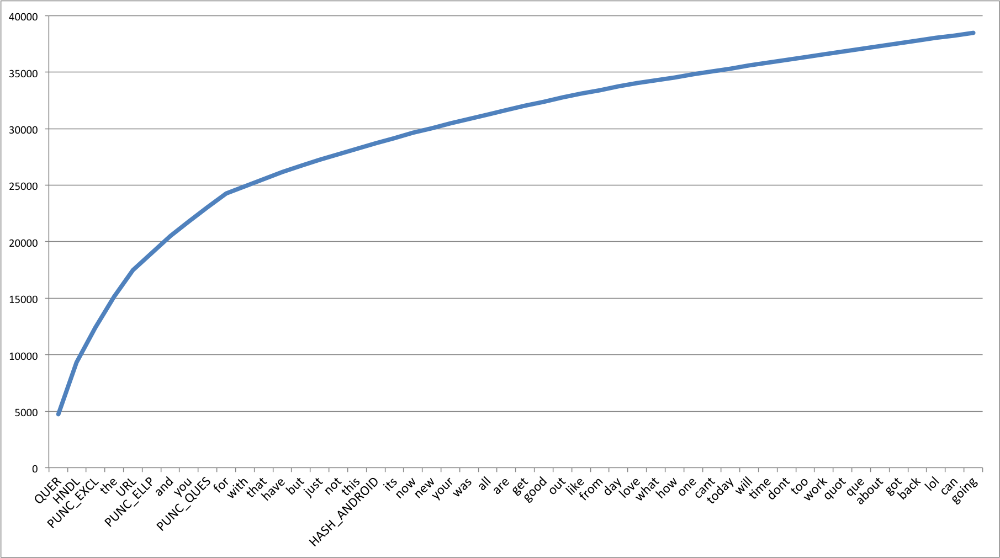

Figure 3: Cumulative Frequency Plot for 50 Most Frequent Unigrams

We also observe that the unigrams nicely follow Zipf’s law. It states that in
a corpus of natural language, the frequency of any word is inversely
proportional to its rank in the frequency table. Figure 4 is a plot of log
frequency versus log rank of our dataset. A linear trendline fits well with
the data.

  

log( f ) = −0.9799 log( r ) + 3.9838

(1)

  

f = 103.9838 r−0.9799

(2)

  

f ∝

1

* * *

r  

(3)

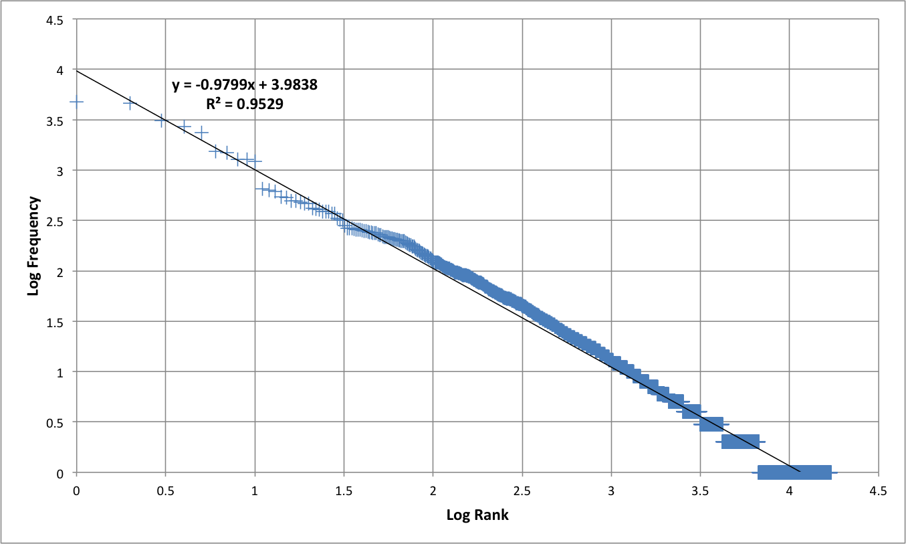

Figure 4: Zipf's Law - Log Frequency versus Log Rank plot for unigrams

####  3.4.2  N-grams

N-gram refers to an n-long sequence of words. Probabilistic Language Models
based on Unigrams, Bigrams and Trigrams can be successfully used to predict
the next word given a current context of words. In the domain of sentiment
analysis, the performance of N-grams is unclear. According to Pang et al.,
some researchers report that unigrams alone are better than bigrams for
classification movie reviews, while some others report that bigrams and
trigrams yield better product-review polarity classification [1].

As the order of the n-grams increases, they tend to be more and more sparse.
Based on our experiments, we find that number of bigrams and trigrams increase
much more rapidly than the number of unigrams with the number of Tweets.
Figure 5 shows the number of n-grams versus number of Tweets. We can observe
that bigrams and trigrams increase almost linearly where as unigrams are
increasing logarithmically.

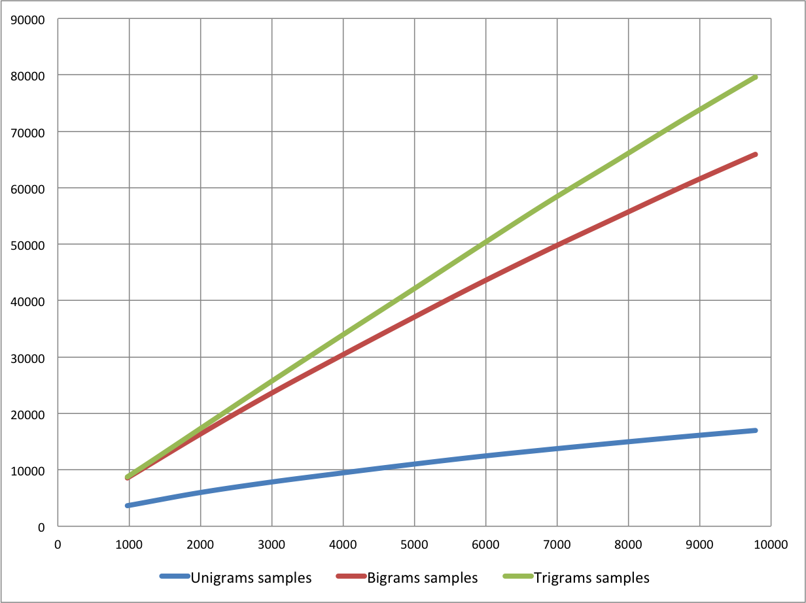

Figure 5: Number of n-grams vs. Number of Tweets

Because higher order n-grams are sparsely populated, we decide to trim off the
n-grams that are not seen more than once in the training corpus, because
chances are that these n-grams are not good indicators of sentiments. After
the filtering out non-repeating n-grams, we see that the number of n-grams is
considerably decreased and equals the order of unigrams, as shown in Figure 6
.

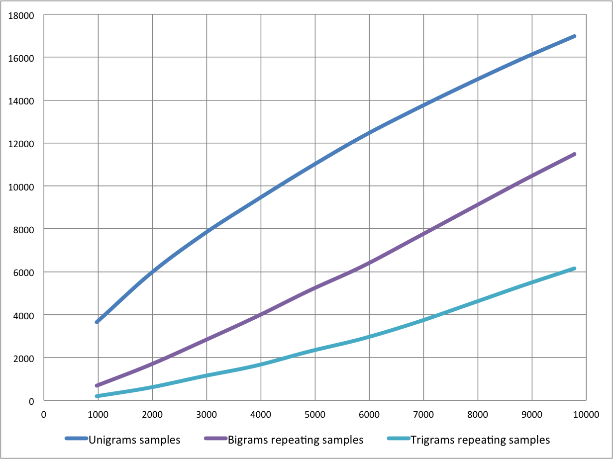

Figure 6: Number of repeating n-grams vs. Number of Tweets

Figure 7 and Figure 8 show the cumulative distribution of the most frequent
bigrams and trigrams respectively.

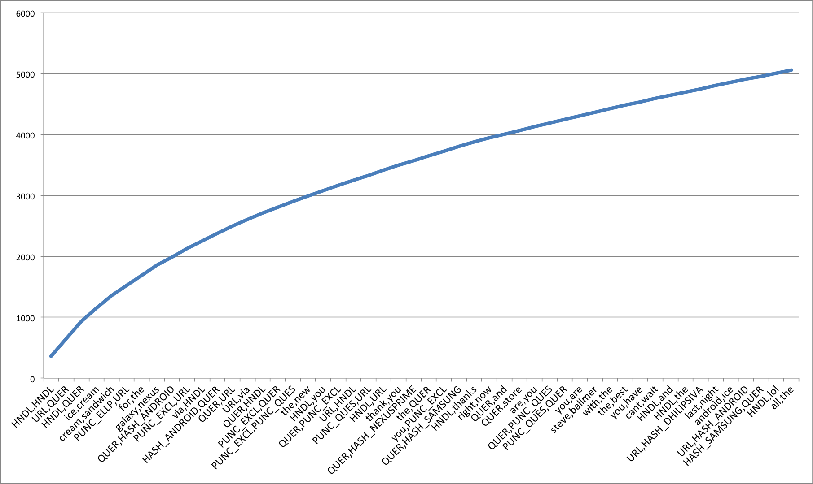

Figure 7: Cumulative Frequency Plot for 50 Most Frequent Bigrams

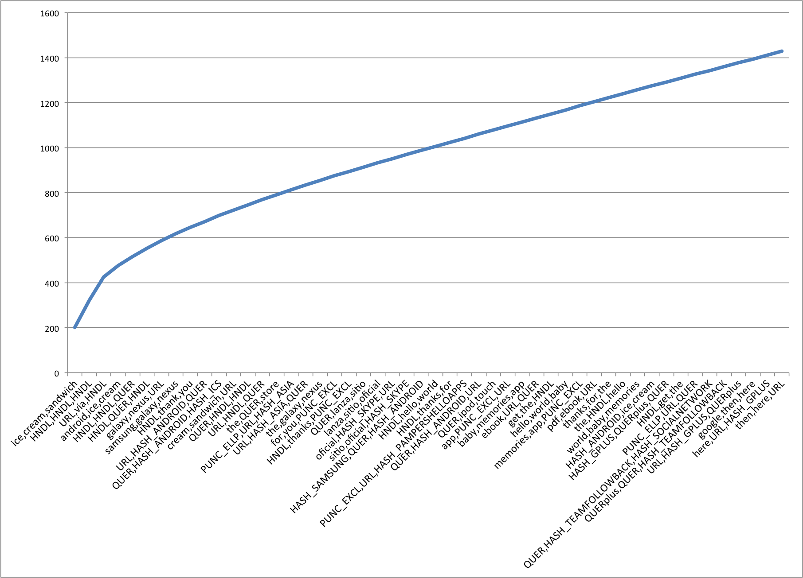

Figure 8: Cumulative Frequency Plot for 50 Most Frequent Trigrams

####  3.4.3  Negation Handling

The need negation detection in sentiment analysis can be illustrated by the
difference in the meaning of the phrases, "This is good" vs. "This is not
good" However, the negations occurring in natural language are seldom so
simple. Handling the negation consists of two tasks – Detection of explicit
negation cues and the scope of negation of these words.

Councill et al. look at whether negation detection is useful for sentiment
analysis and also to what extent is it possible to determine the exact scope
of a negation in the text [7]. They describe a method for negation detection
based on Left and Right Distances of a token to the nearest explicit negation
cue.

#### Detection of Explicit Negation Cues

To detect explicit negation cues, we are looking for the following words in
Table 8 . The search is done using regular expressions.

<table border="1">
<tr><td align="left">S.No. </td><td align="left">Negation Cues </td></tr>
<tr><td align="left">1.  </td><td align="left">never </td></tr>
<tr><td align="left">2.  </td><td align="left">no </td></tr>
<tr><td align="left">3.  </td><td align="left">nothing </td></tr>
<tr><td align="left">4.  </td><td align="left">nowhere </td></tr>
<tr><td align="left">5.  </td><td align="left">noone </td></tr>
<tr><td align="left">6.  </td><td align="left">none </td></tr>
<tr><td align="left">7.  </td><td align="left">not </td></tr>
<tr><td align="left">8.  </td><td align="left">havent </td></tr>
<tr><td align="left">9.  </td><td align="left">hasnt </td></tr>
<tr><td align="left">10.  </td><td align="left">hadnt </td></tr>
<tr><td align="left">11.  </td><td align="left">cant </td></tr>
<tr><td align="left">12.  </td><td align="left">couldnt </td></tr>
<tr><td align="left">13.  </td><td align="left">shouldnt </td></tr>
<tr><td align="left">14.  </td><td align="left">wont </td></tr>
<tr><td align="left">15.  </td><td align="left">wouldnt </td></tr>
<tr><td align="left">16.  </td><td align="left">dont </td></tr>
<tr><td align="left">17.  </td><td align="left">doesnt </td></tr>
<tr><td align="left">18.  </td><td align="left">didnt </td></tr>
<tr><td align="left">19.  </td><td align="left">isnt </td></tr>
<tr><td align="left">20.  </td><td align="left">arent </td></tr>
<tr><td align="left">21.  </td><td align="left">aint </td></tr>
<tr><td align="left">22.  </td><td align="left">Anything ending with "n't" </td></tr></table>

Table 8: Explicit Negation Cues

#### Scope of Negation

Words immediately preceding and following the negation cues are the most
negative and the words that come farther away do not lie in the scope of
negation of such cues. We define left and right negativity of a word as the
chances that meaning of that word is actually the opposite. Left negativity
depends on the closest negation cue on the left and similarly for Right
negativity. Figure 9 illustrates the left and right negativity of words in a
tweet.

Figure 9: Scope of Negation

##  4  Experimentation

We train 90% of our data using different combinations of features and test
them on the remaining 10%. We take the features in the following combinations
- only unigrams, unigrams + filtered bigrams and trigrams, unigrams +
negation, unigrams + filtered bigrams and trigrams + negation. We then train
classifiers using different classification algorithms - Naive Bayes Classifier
and Maximum Entropy Classifier.

The task of classification of a tweet can be done in two steps - first,
classifying "neutral" (or "subjective") vs. "objective" tweets and second,
classifying objective tweets into "positive" vs. "negative" tweets. We also
trained 2 step classifiers. The accuracies for each of these configuration are
shown in Figure 10 , we discuss these in detail below.

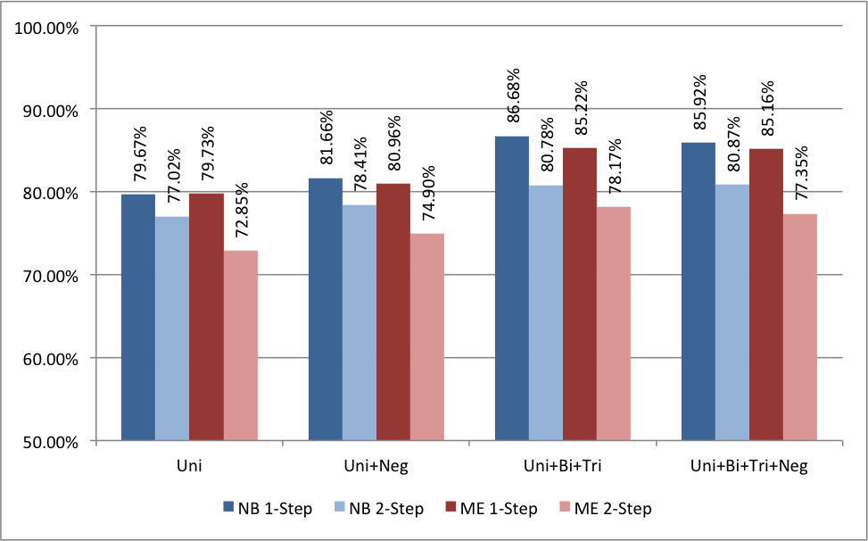

Figure 10: Accuracy for Naive Bayes Classifier

###  4.1  Naive Bayes

Naive Bayes classifier is the simplest and the fastest classifier. Many
researchers [2], [4] claim to have gotten best results using this classifier.

For a given tweet, if we need to find the label for it, we find the
probabilities of all the labels, given that feature and then select the label
with maximum probability.

  

labelNB : = argmaxlabel P(label|features)

(4)

In order to find the probability for a label, this algorithm first uses the
Bayes rule to express P(label - features) in terms of P(label) and P(features
- label) as,

  

P(label|features) =

P(label) * P(features|label)

* * *

P(features)  

(5)

Making the `naive' assumption that all the features are independent,

  

P(label|features) =

P(label) * P(f1|label) * ... * P(fn|label)

* * *

P(features)  

(6)

Rather than computing P(featues) explicitly, we can just calculate the
denominator for each label, and normalize them so they sum to one:

  

P(label|features) =

P(label) * P(f1|label) * ... * P(fn|label)

* * *

  
∑  
l  

( P(l) * P(f1|l) * ... * P(fn|l) )

(7)

The results from training the Naive Bayes classifier are shown below in Figure
10 . The accuracy of Unigrams is the lowest at 79.67%. The accuracy increases
if we also use Negation detection (81.66%) or higher order n-grams (86.68%).
We see that if we use both Negation detection and higher order n-grams, the
accuracy is marginally less than just using higher order n-grams (85.92%). We
can also note that accuracies for double step classifier are lesser than those
for corresponding single step.

We have also shown Precision versus Recall values for Naive Bayes classifier
corresponding to different classes – Negative, Neutral and Positive in Figure
11 . The solid markers show the P-R values for single step classifier and
hollow markers show the affect of using double step classifier. Different
points are for different feature sets. We can see that both precision as well
as recall values are higher for single step than that for double step.

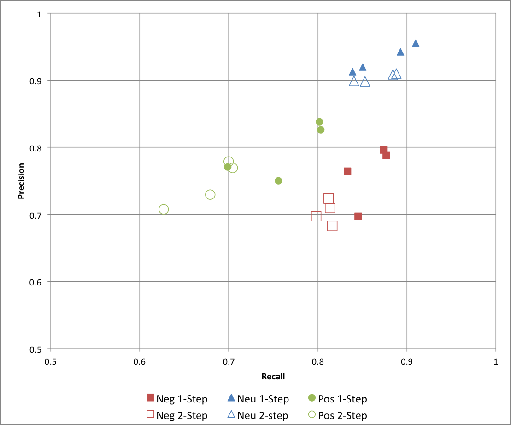

Figure 11: Precision vs. Recall for Naive Bayes Classifier

###  4.2  Maximum Entropy Classifier

This classifier works by finding a probability distribution that maximizes the
likelihood of testable data. This probability function is parameterized by
weight vector. The optimal value of which can be found out using the method of
Lagrange multipliers.

  

P(label|features) =

  
∑  
i  

wi fi(label)

* * *

  
∑  
l ∈ labels  

  
∑  
i  

wi fi(l)

(8)

The results from training the Naive Bayes classifier are shown below in Figure
10 . Accuracies follow a similar trend as compared to Naive Bayes classifier.
Unigram is the lowest at 79.73% and we see an increase for negation detection
at 80.96%. The maximum is achieved with unigrams, bigrams and trigrams at
85.22% closely followed by n-grams and negation at 85.16%. Once again, the
accuracies for double step classifiers are considerably lower.

Precision versus Recall map is also shown for maximum entropy classifier in
Figure 12 . Here we see that precision of "neutral" class increase by using a
double step classifier, but with a considerable decrease in its recall and
slight fall in precision of "negative" and "positive" classes.

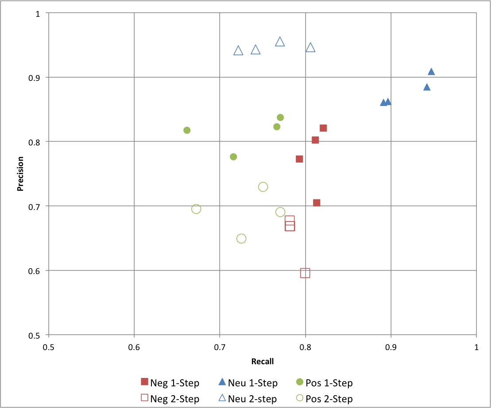

Figure 12: Precision vs. Recall for Maximum Entropy Classifier

##  5  Future Work

**Investigating Support Vector Machines**
     Several papers have discussed the results using Support Vector Machines (SVMs) also. The next step would be to test our approach on SVMs. However, Go, Bhayani and Huang have reported that SVMs do not increase the accuracy [2]. 
**Building a classifier for Hindi tweets**
     There are many users on Twitter that use primarily Hindi language. The approach discussed here can be used to create a Hindi language sentiment classifier. 
**Improving Results using Semantics Analysis**
     Understanding the role of the nouns being talked about can help us better classify a given tweet. For example, "Skype often crashing: microsoft, what are you doing?" Here Skype is a product and Microsoft is a company. We can use semantic labellers to achieve this. Such an approach is discussed by Saif, He and Alani [6]. 

##  6  Conclusion

In this paper, we create a sentiment classifier for twitter using labelled
data sets. We also investigate the relevance of using a double step classifier
and negation detection for the purpose of sentiment analysis.

Our baseline classifier that uses just the unigrams achieves an accuracy of
around 80.00%. Accuracy of the classifier increases if we use negation
detection or introduce bigrams and trigrams. Thus we can conclude that both
Negation Detection and higher order n-grams are useful for the purpose of text
classification. However, if we use both n-grams and negation detection, the
accuracy falls marginally. We also note that Single step classifiers out
perform double step classifiers. In general, Naive Bayes Classifier performs
better than Maximum Entropy Classifier.

We achieve the best accuracy of 86.68% in the case of Unigrams + Bigrams +
Trigrams, trained on Naive Bayes Classifier.

## References

[1] Bo Pang and Lillian Lee. Opinion mining and sentiment analysis. _Foundations and trends in information retrieval_, 2(1-2):pages 1-135, 2008. 

[2] Alec Go, Richa Bhayani, and Lei Huang. Twitter sentiment classification using distant supervision. _Processing_, pages 1-6, 2009. 

[3] Niek Sanders. Twitter sentiment corpus. http://www.sananalytics.com/lab/twitter-sentiment/. Sanders Analytics. 

[4] Alexander Pak and Patrick Paroubek. Twitter as a corpus for sentiment analysis and opinion mining. volume 2010, pages 1320-1326, 2010. 

[5] Efthymios Kouloumpis, Theresa Wilson, and Johanna Moore. Twitter sentiment analysis: The good the bad and the omg! _ICWSM_, 11:pages 538-541, 2011. 

[6] Hassan Saif, Yulan He, and Harith Alani. Semantic sentiment analysis of twitter. In _The Semantic Web-ISWC 2012_, pages 508-524. Springer, 2012. 

[7] Isaac G Councill, Ryan McDonald, and Leonid Velikovich. What's great and what's not: learning to classify the scope of negation for improved sentiment analysis. In _Proceedings of the workshop on negation and speculation in natural language processing_, pages 51-59. Association for Computational Linguistics, 2010. 

[8] Ilia Smirnov. Overview of stemming algorithms. _Mechanical Translation_, 2008. 

[9] Martin F Porter. An algorithm for suffix stripping. _Program: electronic library and information systems_, 40(3):pages 211-218, 2006. 

[10] Balakrishnan Gokulakrishnan, P Priyanthan, T Ragavan, N Prasath, and A Perera. Opinion mining and sentiment analysis on a twitter data stream. In _Advances in ICT for Emerging Regions (ICTer), 2012 International Conference on. IEEE_, 2012. 

[11] John Ross Quinlan. _C4. 5: programs for machine learning_, volume 1\. Morgan kaufmann, 1993. 

[12] Steven Bird, Ewan Klein, and Edward Loper. _Natural language processing with Python_. " O'Reilly Media, Inc.", 2009.

  
  

* * *

File translated from TEX by [ TTH](http://hutchinson.belmont.ma.us/tth/),
version 4.03.  
On 30 Jul 2014, 01:16.

